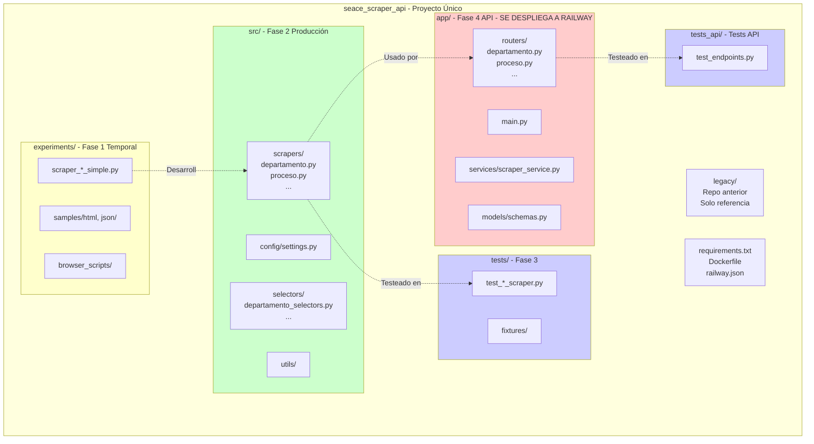
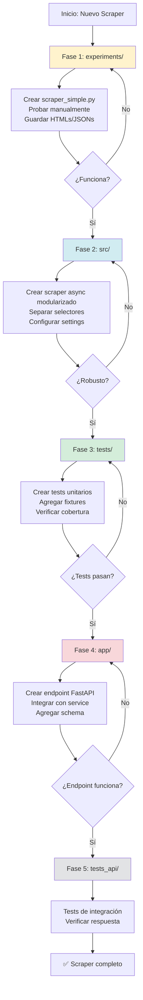

# Plan de Desarrollo: SEACE Scraper API

## Aclaración Importante: Estructura del Proyecto

**NO son 4 subproyectos separados.** Es un **proyecto único** que evoluciona con el siguiente flujo:

1. **Experimentos** (temporal) → 2. **Código de producción** → 3. **Tests** → 4. **API** (lo que se despliega)



## Estructura del Proyecto Único

```
seace_scraper_api/
├── legacy/                    # Repo anterior clonado (referencia)
├── experiments/               # FASE 1: Pruebas empíricas (temporal)
│   ├── scraper_departamento_simple.py
│   ├── scraper_proceso_simple.py
│   ├── samples/
│   │   ├── html/
│   │   └── json/
│   └── browser_scripts/       # Scripts JS para consola navegador
├── src/                       # FASE 2: Código de producción (modularizado)
│   ├── scrapers/
│   │   ├── base.py            # Clase base para scrapers
│   │   ├── departamento.py   # Scraper por departamento (async)
│   │   ├── proceso.py         # Scraper por ID proceso (async)
│   │   └── ...                # Futuros scrapers
│   ├── config/
│   │   └── settings.py        # Configuraciones compartidas
│   ├── selectors/
│   │   ├── departamento_selectors.py
│   │   ├── proceso_selectors.py
│   │   └── ...
│   └── utils/                 # Utilidades compartidas
├── tests/                     # FASE 3: Tests unitarios
│   ├── test_departamento_scraper.py
│   ├── test_proceso_scraper.py
│   ├── fixtures/              # HTMLs de ejemplo para tests
│   └── ...
├── app/                       # FASE 4: API FastAPI (LO QUE SE DESPLIEGA A RAILWAY)
│   ├── main.py                # FastAPI app principal
│   ├── routers/
│   │   ├── departamento.py    # Endpoint: /scrape/departamento/{departamento}
│   │   ├── proceso.py         # Endpoint: /scrape/proceso/{id}
│   │   └── ...                # Futuros endpoints
│   ├── services/
│   │   └── scraper_service.py # Integra scrapers de src/
│   ├── models/
│   │   └── schemas.py         # Pydantic models
│   └── config.py
├── tests_api/                 # Tests de integración de la API
│   └── test_endpoints.py
├── docs/                      # DOCUMENTACIÓN ORGANIZADA
│   ├── active/                # Markdowns activos - trabajo en progreso
│   │   ├── current_task.md    # Tarea actual que estamos haciendo
│   │   ├── scraper_fecha.md   # Documentación de scraper en desarrollo
│   │   └── ...
│   ├── completed/             # Markdowns completados - ya implementados
│   │   ├── scraper_departamento.md
│   │   ├── api_setup.md
│   │   └── ...
│   ├── archived/              # Markdowns desechados - ideas no implementadas
│   │   ├── old_approach.md
│   │   └── ...
│   ├── ideas/                 # Ideas futuras y todolists
│   │   ├── future_scrapers.md
│   │   ├── improvements.md
│   │   └── todo.md
│   └── reference/             # Documentación de referencia
│       ├── api_endpoints.md
│       ├── architecture.md
│       └── ...
├── pyproject.toml             # Configuración del proyecto (PEP 621) - Similar a package.json
├── requirements.txt           # Generado desde pyproject.toml (para compatibilidad)
├── Makefile                   # Scripts de desarrollo (test, run, deploy, etc.)
├── Dockerfile                 # Para Railway
├── docker-compose.yml         # Para desarrollo local
├── railway.json               # Config Railway
└── README.md                  # README principal (breve, referencia a docs/)
```

## Flujo de Trabajo: Cómo Agregar un Nuevo Scraper/Endpoint



Cuando quieras agregar un nuevo scraper (ej: "scrapear por fecha"), sigues este ciclo:

### Paso 1: Fase Empírica (experiments/)

1. Crear `experiments/scraper_fecha_simple.py` - scraper monolítico simple
2. Probar manualmente, guardar HTMLs en `experiments/samples/html/`
3. Guardar resultados JSON en `experiments/samples/json/`
4. Crear scripts JS en `experiments/browser_scripts/` si es necesario
5. **Objetivo:** Validar que el scraping funciona

### Paso 2: Versión de Producción (src/)

1. Crear `src/scrapers/fecha.py` - scraper async modularizado
2. Crear `src/selectors/fecha_selectors.py` - selectores específicos
3. Usar `src/config/settings.py` para configuraciones
4. **Objetivo:** Código robusto, async, reutilizable

### Paso 3: Tests (tests/)

1. Crear `tests/test_fecha_scraper.py` - tests unitarios
2. Agregar HTMLs de ejemplo en `tests/fixtures/`
3. **Objetivo:** Verificar que el scraper funciona correctamente

### Paso 4: Endpoint API (app/)

1. Crear `app/routers/fecha.py` - endpoint FastAPI
2. Integrar con `app/services/scraper_service.py`
3. Agregar schema en `app/models/schemas.py` si es necesario
4. **Objetivo:** Exponer el scraper como endpoint HTTP

### Paso 5: Test del Endpoint (tests_api/)

1. Agregar tests en `tests_api/test_endpoints.py`
2. **Objetivo:** Verificar que el endpoint funciona

## ¿Qué se Despliega a Railway?

**Solo la carpeta `app/`** (Fase 4) se despliega a Railway. La API importa los scrapers desde `src/`, por lo que:

- Railway necesita: `app/`, `src/`, `pyproject.toml` (o `requirements.txt`), `Dockerfile`
- No necesita: `experiments/`, `tests/`, `Makefile` (aunque pueden estar en el repo)

## Fase 0: Preparación Inicial

- Clonar repo anterior en `legacy/` para referencia
- Crear estructura de carpetas base
- Configurar `.gitignore` apropiado
- Crear `pyproject.toml` con dependencias (estándar moderno)
- Crear `Makefile` con scripts de desarrollo
- Generar `requirements.txt` desde `pyproject.toml` (opcional, para compatibilidad)
- Inicializar git nuevo (limpio)

## Fase Inicial: Primeros 2 Scrapers (del proyecto anterior)

Basándote en los 2 scrapers que ya tienes:

1. **Scraper 1** (ej: por departamento):

   - `experiments/scraper_departamento_simple.py` → `src/scrapers/departamento.py` → `tests/test_departamento_scraper.py` → `app/routers/departamento.py`

2. **Scraper 2** (ej: por proceso):

   - `experiments/scraper_proceso_simple.py` → `src/scrapers/proceso.py` → `tests/test_proceso_scraper.py` → `app/routers/proceso.py`

Luego, para cada nuevo scraper, repites el ciclo.

## Gestión de Dependencias y Scripts

### ¿Por qué pyproject.toml + pip + Makefile?

**Comparación con Node.js:**

- `package.json` → `pyproject.toml` (metadatos y dependencias)
- `npm scripts` → `Makefile` (comandos de desarrollo)
- `npm install` → `pip install -e ".[dev]"` (instalar dependencias)

**Ventajas sobre otras opciones:**

- ✅ **Estándar oficial** (PEP 621) - No es una herramienta externa como Poetry
- ✅ **Compatible con Railway** - Funciona sin problemas
- ✅ **Sin dependencias adicionales** - Solo pip (que ya viene con Python)
- ✅ **Profesional** - Usado en proyectos enterprise
- ✅ **Flexible** - Puedes usar cualquier herramienta que soporte pyproject.toml

**Por qué NO uv (tu experiencia):**

- uv es relativamente nuevo y puede tener problemas de compatibilidad
- pyproject.toml + pip es más universal y estable

**Por qué NO solo requirements.txt:**

- No centraliza metadatos del proyecto
- No separa dependencias de desarrollo
- Menos moderno (aunque aún funcional)

### pyproject.toml (Estándar Moderno - Similar a package.json)

**Recomendación profesional:** Usar `pyproject.toml` (PEP 621) como archivo principal de configuración.

Ventajas:

- ✅ Estándar moderno de Python (equivalente a `package.json` en Node.js)
- ✅ Centraliza metadatos, dependencias y configuración de herramientas
- ✅ Compatible con Railway y todas las herramientas modernas
- ✅ Más legible que `requirements.txt`
- ✅ Soporta dependencias de desarrollo separadas

Estructura típica:

```toml
[project]
name = "seace-scraper-api"
version = "0.1.0"
description = "API para scraper de SEACE"
requires-python = ">=3.10"
dependencies = [
    "fastapi>=0.104.0",
    "uvicorn[standard]>=0.24.0",
    "httpx>=0.25.0",
    "beautifulsoup4>=4.12.0",
    "pydantic>=2.5.0",
]

[project.optional-dependencies]
dev = [
    "pytest>=7.4.0",
    "pytest-asyncio>=0.21.0",
    "black>=23.0.0",
    "ruff>=0.1.0",
]
```

### Scripts (Equivalente a npm scripts)

**Opción 1: Makefile (Recomendado para proyectos profesionales)**

```makefile
.PHONY: install test run dev docker-build docker-run

install:
	pip install -e ".[dev]"

test:
	pytest tests/ tests_api/ -v

run:
	uvicorn app.main:app --reload

dev:
	uvicorn app.main:app --reload --host 0.0.0.0 --port 8000

docker-build:
	docker build -t seace-scraper-api .

docker-run:
	docker-compose up
```

**Opción 2: Scripts Python simples** (alternativa si no tienes `make`)

- Crear `scripts/` con archivos `.py` ejecutables

### requirements.txt

Se puede generar desde `pyproject.toml` para compatibilidad:

```bash
pip-compile pyproject.toml  # Si usas pip-tools
# O mantenerlo manualmente sincronizado
```

**Dependencias principales:**

- `fastapi` - Framework API
- `uvicorn` - ASGI server
- `httpx` - Cliente HTTP async (recomendado sobre aiohttp)
- `beautifulsoup4` - Parsing HTML
- `pytest` - Testing (dev)
- `pydantic` - Validación de datos (viene con FastAPI)

## Consideraciones Importantes

1. **Proyecto único, no subproyectos**: Todo está en un solo repo, las "fases" son carpetas organizacionales
2. **Flujo iterativo**: Para cada nuevo scraper, repites el ciclo: experiments → src → tests → app
3. **Despliegue**: Solo `app/` + `src/` se necesitan en Railway (el resto puede estar en el repo)
4. **Git**: Iniciar repo nuevo limpio, `legacy/` puede estar en `.gitignore`
5. **Modularidad**: Desde `src/`, código reutilizable, async y testeable
6. **Experimentos temporales**: `experiments/` puede limpiarse periódicamente, pero es útil mantener ejemplos

## Ventajas de Esta Estructura

- **Clara separación**: Sabes dónde está cada cosa
- **Escalable**: Fácil agregar nuevos scrapers siguiendo el mismo patrón
- **Mantenible**: Código de producción separado de experimentos
- **Testeable**: Tests claramente organizados
- **Despliegue simple**: Railway solo necesita `app/` y `src/`

## Organización de Documentación (docs/)

### Estructura de Carpetas

```
docs/
├── active/          # 📝 Trabajo en progreso - Markdowns que estamos usando AHORA
├── completed/       # ✅ Completados - Ya implementados, movidos aquí cuando terminan
├── archived/        # 🗄️ Desechados - Ideas que no se implementaron
├── ideas/           # 💡 Futuro - Ideas, todolists, mejoras futuras
└── reference/       # 📚 Referencia - Documentación permanente (arquitectura, endpoints, etc.)
```

### Flujo de Trabajo con Markdowns

**1. Cuando empiezas una nueva tarea:**

- Crear `docs/active/current_task.md` o `docs/active/scraper_X.md`
- Documentar lo que vas a hacer, problemas encontrados, decisiones
- **Este es el archivo que compartes conmigo** para trabajar juntos

**2. Durante el desarrollo:**

- Actualizar el markdown en `active/` con progreso, notas, problemas
- Puedes referenciar este archivo cuando me pidas ayuda
- Yo puedo leerlo para entender el contexto

**3. Cuando completas una tarea:**

- Mover el markdown de `active/` → `completed/`
- Opcional: Crear un resumen en `reference/` si es información útil permanente

**4. Si descartas una idea:**

- Mover el markdown de `active/` → `archived/`
- Mantenerlo por si acaso, pero fuera del camino

**5. Para ideas futuras:**

- Crear en `ideas/` directamente
- Puedes tener `ideas/todo.md` para lista general
- O `ideas/future_scrapers.md` para scrapers pendientes

### Cómo Trabajar conmigo usando Markdowns

**Flujo recomendado:**

1. **Al empezar una tarea:**

   - Crea `docs/active/tarea_actual.md` con:
     - Qué quieres hacer
     - Contexto necesario
     - Problemas conocidos
   - Dime: "Lee `docs/active/tarea_actual.md` y ayúdame con..."

2. **Durante el desarrollo:**

   - Actualiza el markdown con:
     - Decisiones tomadas
     - Problemas encontrados
     - Código de ejemplo o snippets
   - Puedes decirme: "Actualiza `docs/active/tarea_actual.md` con lo que acabamos de hacer"

3. **Cuando necesitas contexto:**

   - Yo puedo leer automáticamente archivos que mencionas
   - O puedes copiar partes relevantes directamente en el chat
   - Ejemplo: "Mira esta parte de `docs/active/scraper_fecha.md`..."

4. **Al completar:**

   - Dime: "Mueve `docs/active/tarea_actual.md` a `docs/completed/`"
   - O hazlo manualmente y actualiza `docs/reference/` si es necesario

**Ejemplos de comandos útiles:**

- "Lee `docs/active/scraper_fecha.md` y continúa la implementación"
- "Actualiza `docs/active/current_task.md` con las decisiones de hoy"
- "Crea `docs/ideas/future_scrapers.md` con estas ideas: ..."
- "Revisa `docs/completed/scraper_departamento.md` para referencia"

### Ventajas de Esta Organización

- ✅ **No confunde**: Solo `active/` tiene trabajo actual
- ✅ **Historial claro**: `completed/` muestra qué se hizo
- ✅ **Referencia rápida**: `reference/` tiene info permanente
- ✅ **Ideas organizadas**: `ideas/` no se mezcla con trabajo activo
- ✅ **Limpieza fácil**: Mover archivos entre carpetas según estado

### Ejemplo de Uso

```
# Inicio de tarea
docs/active/scraper_departamento.md  # Trabajando aquí

# Durante desarrollo
docs/active/scraper_departamento.md  # Actualizando con notas

# Al completar
docs/completed/scraper_departamento.md  # Movido aquí
docs/reference/api_endpoints.md  # Actualizado con nuevo endpoint
```

## Próximos Pasos Inmediatos

1. Clonar repo anterior en `legacy/` para referencia
2. Crear estructura de carpetas completa (incluyendo `docs/`)
3. Configurar `.gitignore` (incluir `legacy/` si no quieres subirlo)
4. Crear `pyproject.toml` con todas las dependencias (estándar moderno PEP 621)
5. Crear `Makefile` con scripts útiles (test, run, dev, docker-build, etc.)
6. Generar `requirements.txt` desde `pyproject.toml` (opcional, para compatibilidad)
7. Crear estructura inicial de `docs/` con carpetas organizadas
8. Inicializar git nuevo (limpio)
9. Comenzar con los 2 scrapers existentes:

   - Migrar cada uno siguiendo el ciclo: experiments → src → tests → app
   - Documentar en `docs/active/` mientras trabajamos
